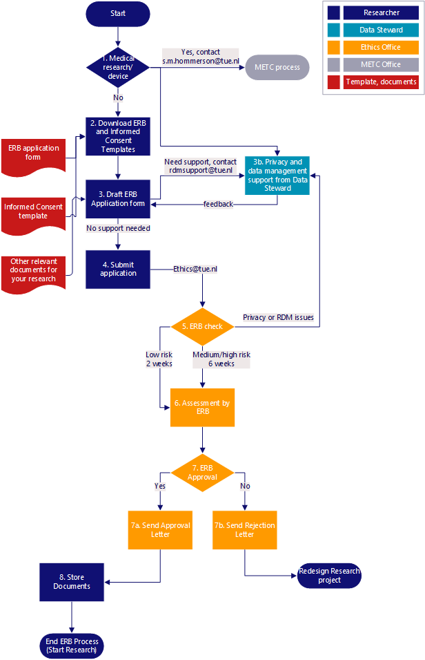

# Ethical Approval

Everyone with TU/e affiliation (including students) must register their research involving human participants and ask for ethical approval. Ethical approval is also necessary when processing data from human participants that were collected by an external party, which is considered the processing of secondary data.

If your research or educational activity involves one of the following items, you need to register your research project for [**ethical review**](https://tuenl.sharepoint.com/sites/intranet-ethical-review/SitePages/Organisatie.aspx):

- Human participants
- Any participant involved in data collection, such as survey, interview, observation, experiment, user testing, etc.
- Including participants who report on an aggregated level, such as an organizational level.
- [**Personal data**](https://tue.atlassian.net/servicedesk/customer/portal/3/article/2641100840) (e.g. names, e-mail addresses, home address, nationality, ethnicity, income, gender, education, place of employment, work position, location data (e.g., GPS, IP address), audio and video recordings, images (e.g., photos of participants, MRI or ultrasound scans, images of body parts), physiological data, health and medical data, personal preferences and beliefs) – even if this data is anonymized ethical approval is still needed!
- Existing databases with personal data;
- Human tissue (non-commercial);
- A medical device or technology for medical device development;
- A collaboration with a healthcare facility, hospital, rehabilitation center, etc, including all e/MTIC research projects.
- When Medical Research Ethics Committee (MREC) submission is done by the healthcare facility.

Remember: if your research involves human participants and/or personal data, you cannot start your research without ethical approval.

There are multiple options to apply for ethical review by TU/e’s Ethical Review Board (ERB) and the most suitable option for you depends on the nature of research you are planning to conduct. You can select one of the following:

- [Ethical review for non-medical research for scientific staff](https://tuenl.sharepoint.com/sites/intranet-ethical-review/SitePages/Ethical-review-by-ERB-for-non-medical-research.aspx "https://tuenl.sharepoint.com/sites/intranet-ethical-review/SitePages/Ethical-review-by-ERB-for-non-medical-research.aspx").
- [Ethical review for medical research or research with a medical device for scientific staff](https://tuenl.sharepoint.com/sites/intranet-ethical-review/SitePages/clinical-research-at-tue.aspx "https://tuenl.sharepoint.com/sites/intranet-ethical-review/SitePages/clinical-research-at-tue.aspx").
- [Ethical review for Bachelor and Master students](https://tuenl.sharepoint.com/sites/intranet-ethical-review/SitePages/Ethical-review-for-Bachelor-and-Master-students.aspx "https://tuenl.sharepoint.com/sites/intranet-ethical-review/SitePages/Ethical-review-for-Bachelor-and-Master-students.aspx").

The figure below shows the workflow and processing time for ethical review.

If necessary, consult a data steward on RDM and privacy-related sections of the ERB form. You can contact the RDM support team via [**rdmsupport@remove-this.tue.nl**](https://www.tue.nl/en/our-university/library/library-for-researchers-and-phds/research-data-management/before-research/ethical-aproval#) or reach out to a [**data steward assigned to your faculty**](https://www.tue.nl/en/our-university/library/library-for-researchers-and-phds/research-data-management/contact-a-data-steward) at least two weeks before submitting your application to the ERB.

## FAQ  

**I am planning a research project that involves human participants and/or personal data. What steps should I take before I can start?**

Before you start your research involving human participants and/or personal data, you need to obtain ethical approval. Please visit the [Ethical Review Board](https://www.tue.nl/en/our-university/about-the-university/integrity/tue-ethical-review-board/) page to select a process that applies to your situation. You can also download the ERB form, which needs to be completed for your ERB application. If you have questions regarding privacy topics or need support completing the ERB form, contact a [Data Steward](/docs/contact.md).
