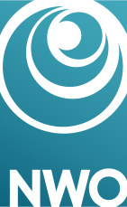
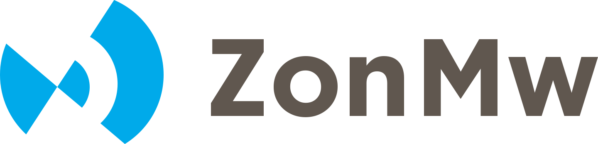
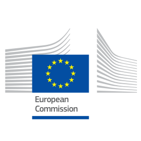
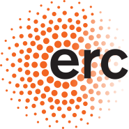

# Funder Requirements

Research data management (RDM) has become an integral part of the application procedure of many research funders. Funders increasingly began recognizing the importance of research data management in ensuring transparency, reproducibility, and the long-term impact of research. Many funding organizations have implemented specific requirements and guidelines regarding research data management that researchers must adhere to in order to receive funding. These requirements may vary depending on the funding agency and the type of research being conducted.

It's important you carefully review the specific data management requirements of the funding agency you are applying to and ensure that you are in compliance with those guidelines throughout the research project. Failure to meet data management requirements could result in the loss of funding or difficulties in publishing research outcomes.

The policies of several important research funders are briefly summarized below.

## NWO

**Pre-award stage**: All NWO's research proposals include a section on data management. In that section, you are asked to consider how you will manage the research data the project will generate and plan for which data will be preserved and be made publicly available.

**Post-award stage**: Once your project has been awarded with funding, you are required to elaborate the data management section into a data management plan (DMP). The DMP needs to be submitted into ISAAC no later than **four months after the project has been awarded**. The approval of this plan is a prerequisite for NWO disbursing the grant. You can complete your DMP by simply logging in to the [Research Cockpit](https://tue.atlassian.net/helpcenter/research/ "https://tue.atlassian.net/helpcenter/research/") and accessing the [DMP tool](https://tue.atlassian.net/helpcenter/research/portal/3/article/2712272900 "https://tue.atlassian.net/helpcenter/research/portal/3/article/2712272900") from your dashboard. This DMP template has been approved by NWO, so you can download your PDF and submit it to NWO directly (once it has been approved by the dedicated data steward of your department). For any questions or further assistance, please feel free to contact your dedicated [Data Steward](https://www.tue.nl/universiteit/library/library-for-researchers-and-phds/research-data-management/contact-a-data-steward/ "https://www.tue.nl/universiteit/library/library-for-researchers-and-phds/research-data-management/contact-a-data-steward/") at your department. Check also [DMP assessment rubric](https://zenodo.org/record/3629157#.XvnH_-dcKUk), which is used in the assessment of the NWO DMPs.

NWO expects you to consult support staff from the RDM team for the completion of your plan.

## ZonMw

**Pre-award stage**: For most ZonMw programs you do not have to submit a DMP during the grant proposal stage (unless the call for proposals indicates otherwise). ZonMw asks you to include information such as options for data reuse in your project and the costs of RDM activities in your grant proposal.

**Post-award stage**: Once your project has been awarded with funding, you need to finalize a data management plan **within the first three to six months** of your project. ZonMw will not review your DMP, but monitors the outcomes of research data management in a project based on a set of key items during your midterm and final report. The key items relate to several aspects of the FAIR principles. You can complete your DMP by simply logging in to the [Research Cockpit](https://tue.atlassian.net/helpcenter/research/ "https://tue.atlassian.net/helpcenter/research/") and accessing the [DMP tool](https://tue.atlassian.net/helpcenter/research/portal/3/article/2712272900 "https://tue.atlassian.net/helpcenter/research/portal/3/article/2712272900") from your dashboard. This DMP template has been approved by ZonMw, so you can download your PDF and submit it to ZonMw directly (once it has been approved by the dedicated data steward of your department). For any questions or further assistance, please feel free to contact your dedicated [Data Steward](https://www.tue.nl/universiteit/library/library-for-researchers-and-phds/research-data-management/contact-a-data-steward/ "https://www.tue.nl/universiteit/library/library-for-researchers-and-phds/research-data-management/contact-a-data-steward/") at your department.

## Horizon

**Pre-award stage:** At proposal stage, applicants that intend to generate and/or reuse data and/or other research outputs (except for publications) during the project must provide an outline of how the data and/or other research outputs (e.g. workflows, protocols, software, samples) will be managed in line with the [**FAIR principles**](https://www.tue.nl/en/our-university/library/library-for-researchers-and-phds/research-data-management/rdm-themes/fair/).

**Post-award stage:** Beneficiaries must submit a data management plan to the granting authority in accordance with the grant agreement (normally **by month 6** as one of the deliverables). You can complete your DMP by simply logging in to the [Research Cockpit](https://tue.atlassian.net/helpcenter/research/ "https://tue.atlassian.net/helpcenter/research/") and accessing the [DMP tool](https://tue.atlassian.net/helpcenter/research/portal/3/article/2712272900 "https://tue.atlassian.net/helpcenter/research/portal/3/article/2712272900") from your dashboard. For any questions or further assistance, please feel free to contact your dedicated [Data Steward](https://www.tue.nl/universiteit/library/library-for-researchers-and-phds/research-data-management/contact-a-data-steward/ "https://www.tue.nl/universiteit/library/library-for-researchers-and-phds/research-data-management/contact-a-data-steward/") at your department. In cases of a public emergency, and if the work programme requires so, proposers should submit a Data Management Plan (DMP) already when submitting the proposal or at the latest by the signature of the grant agreement.

Some open science practices are mandatory for all beneficiaries per the grant agreement. They concern:

- open access to scientific publications under the conditions required by the grant agreement;
- responsible management of research data in line with the FAIR principles of ‘Findability’, ‘Accessibility’, ‘Interoperability’ and ‘Reusability’, notably through the generalised use of data management plans, and open access to research data under the principle ‘as open as possible, as closed as necessary’, under the conditions required by the grant agreement;
- information about the research outputs/tools/instruments needed to validate the conclusions of scientific publications or to validate/re-use research data;
- digital or physical access to the results needed to validate the conclusions of scientific publications, unless exceptions apply;
- in cases of public emergency, if requested by the granting authority, immediate open access to all research outputs under open licenses or, if exceptions apply, access under fair and reasonable conditions to legal entities that need the research outputs to address the public emergency

More information can be found [**here**](https://ec.europa.eu/info/funding-tenders/opportunities/docs/2021-2027/horizon/guidance/programme-guide_horizon_v1.4_en.pdf).

## ERC

**Pre-award stage:** There is no requirement to address open science and data management in the application.

**Post-award stage:** Under Horizon Europe (Work programmes 2021 and onwards), grantees of all ERC projects that generate research data have to submit a DMP (at the latest **six months after the start of the project**), deposit such data in a trustworthy repository and provide access to them, under the principle “as open as possible, as closed as necessary”. Overall, you should demonstrate that your approach to data management planning is in line with the FAIR principles. The ERC does not prescribe a specific format for the DMPs that its grantees need to submit. Therefore, you can complete you DMP using the TU/e template. You can complete your DMP by simply logging in to the [Research Cockpit](https://tue.atlassian.net/helpcenter/research/ "https://tue.atlassian.net/helpcenter/research/") and accessing the [DMP tool](https://tue.atlassian.net/helpcenter/research/portal/3/article/2712272900 "https://tue.atlassian.net/helpcenter/research/portal/3/article/2712272900") from your dashboard. For any questions or further assistance, please feel free to contact your dedicated [Data Steward](https://www.tue.nl/universiteit/library/library-for-researchers-and-phds/research-data-management/contact-a-data-steward/ "https://www.tue.nl/universiteit/library/library-for-researchers-and-phds/research-data-management/contact-a-data-steward/") at your department. More information can be found [**here**](https://erc.europa.eu/sites/default/files/document/file/ERC_info_document-Open_Research_Data_and_Data_Management_Plans.pdf).

## FAQ

**Does NWO require me to make the research software code available to others?**  
Yes, if the [research code](https://www.tue.nl/en/our-university/library/library-for-researchers-and-phds/research-data-management/rdm-themes/research-software) is needed to access and process the data or if the research software code is the outcome of your research. If you cannot make your software available, you must explain this in your [data management plan](https://www.tue.nl/en/our-university/library/library-for-researchers-and-phds/research-data-management/rdm-themes/data-management-plan).

**What should I do to comply with my funder’s data management requirements?**  
That depends on the funder. Often, you need to address data management in your proposal and write a more elaborate [data management plan](https://www.tue.nl/en/our-university/library/library-for-researchers-and-phds/research-data-management/rdm-themes/data-management-plan) once you have been awarded the funding. Usually, you cannot start your project without approval of the data management plan by the funder. You can find more information about the requirements of several important research funders [here](https://www.tue.nl/en/our-university/library/library-for-researchers-and-phds/research-data-management/rdm-themes/funder-requirements). Note that it is always a good idea to write a data management plan before starting a research project and update it during your research project.
