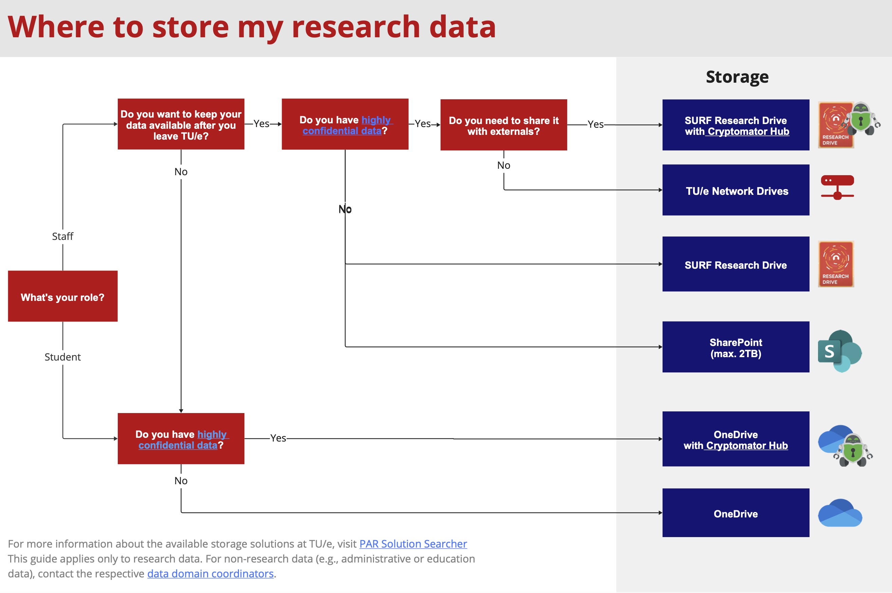

# Data Storage and Sharing

Adopting good practices in storing and sharing your research data can save a lot of time in finding and interpreting, but also securing your data. There are various ways to store and share your research data safely as your project progresses, along with other means to ensure data security.

## Data storage 

Data safety entails protecting data against loss by making regular back-ups of your data, while guaranteeing data security by preventing unauthorized access. Together with appropriate [**data organization**](https://www.tue.nl/en/our-university/library/library-for-researchers-and-phds/research-data-management/rdm-themes/data-organization), such as clear folder structure and adding sufficient [**metadata**](https://www.tue.nl/en/our-university/library/library-for-researchers-and-phds/research-data-management/rdm-themes/documentation-and-metadata) to facilitate re-use of your data, there are various ways to warrant research data safety. Main safe storage facilities supported by TU/e are:

- **TU/e Network drives** **(Primary research storage solution)**

  Departments and research groups can request their collective group folders which staff members have access to. These folders can be used for sharing research data with other TU/e researchers. Network drives are suitable for the storage of regular and special category of personal data as well as any type of confidential data. Data on TU/e network drives are backed up daily and copies (snapshots) are retained for 30 days. For further information or requests, please contact LIS ([lisservices@remove-this.tue.nl](https://www.tue.nl/en/our-university/library/library-for-researchers-and-phds/research-data-management/rdm-themes/data-storage-and-sharing#)).

- **OneDrive (Your own personal TU/e storage)**  
  A cloud storage service for data storage and sharing, hosted by Microsoft. Datasets are stored on servers in Europe. Each TU/e member has access to a personal storage of 1TB space, accessed via TU/e account. Data can be easily shared with other researchers with a Microsoft account, both within and outside TU/e (for collaboration on a project, check Research Drive or Sharepoint options below). Data can also be shared with guest users or external parties via a “share link” functionality. OneDrive can be used to store **[normal personal data](https://tue.atlassian.net/servicedesk/customer/portal/3/article/2641100840)**. Contact your [Data Steward](/docs/contact.md) in case you are going to store sensitive or **[special personal data](https://tue.atlassian.net/servicedesk/customer/portal/3/article/2641100840)**.

**Note:** Upon leaving the university, your personal OneDrive account and all its content will be deleted. If you have project data that others (within your research group/colleagues) may need or your results will be included in a publication, make sure to transfer them into a shared storage, such as Network drive, before your departure from TU/e.

- **SURF ResearchDrive** **(External collaboration storage – preferable)**  
  A cloud storage service that allows data storage, synchronization, and secure sharing of data within research projects. ResearchDrive is hosted by SURF and storage space on ResearchDrive is allocated on a project basis instead of a personal basis, entailing that data storage can be maintained after a researcher has left TU/e. ResearchDrive can provide scalable storage space, with back-ups/disaster recovery and allows setting access rights. The data are stored in the Netherlands and can be shared with TU/e researchers and researchers from other universities and institutes (also abroad). If you are planning to store, **[special category personal data](https://tue.atlassian.net/servicedesk/customer/portal/3/article/2641100840)** please contact your [Data Steward](/docs/contact.md). Further information on ResearchDrive can be found [**here**](https://wiki.surfnet.nl/display/RDRIVE/) and on the [**intranet**](https://tuenl.sharepoint.com/sites/IMSServicecatalogue/SitePages/10.1%20Research%20Data%20Management.aspx).
- **Teams/SharePoint (External collaboration storage – alternative)**  
  With Teams and SharePoint you have additional functionalities for team collaboration and organization wide communication on top of the OneDrive storage. Teams and SharePoint sites can store up to 2.5TB of data. If more storage is needed, contact LIS Services.

To get a full overview of storage solutions offered and supported by TU/e, visit [TU/e Storage Finder](https://research-it.pages.tue.nl/solution-searcher/category-storage.html). The storage finder will help you determine which solution is best suited for your requirements. If you are in doubt, please contact your [Data Steward](/docs/contact.md).

Note that additional security measures are needed when you store or share **[special category personal data](https://tue.atlassian.net/servicedesk/customer/portal/3/article/2641100840)**. For example, you may require client-side encryption if using a storage solution other than TU/e Network drives. For further information, please consult a [Data Steward](/docs/contact.md).

Storing data on personal computers or mobile hard disks or USBs is discouraged due to irregular back-ups and the high potential for loss of the data. Storing data in cloud services outside the EU (Google Drive, Dropbox, iCloud or private (i.e., without TU/e credentials) OneDrive) should also be avoided because of possible non-compliance with the GDPR. Tailored advice on data storing and sharing can be provided, and storage solutions arranged, by the [Data Stewards](/docs/contact.md).

## Data Sharing 

During your research, you may want to share your data with other researchers or organizations. When choosing data storage, consider whether you would like to share your data internally (within TU/e) or externally (outside of TU/e). In [TU/e Storage Finder](https://research-it.pages.tue.nl/solution-searcher/category-storage.html) you can see which storage solutions support your sharing preference.

If you would like to send a data package to internal or external parties without giving them access to your storage, you can always use [**SURFfilesender**](https://www.surf.nl/en/surffilesender-send-large-files-securely-and-encrypted) to send files to anyone outside or inside of TU/e. Make sure to always encrypt files that include **[special category personal data](https://tue.atlassian.net/servicedesk/customer/portal/3/article/2641100840).**

**Note:** Sharing or receiving (personal) data from an external party requires a [**data agreement**](https://tuenl.sharepoint.com/sites/intranet-privacy-security/SitePages/agreements.aspx) the type of agreement depends on the nature of collaboration between the parties. If you plan on sharing your research data or receiving data from a third party, please contact your [**data steward**](https://www.tue.nl/en/our-university/library/library-for-researchers-and-phds/research-data-management/contact-a-data-steward).

## Tips & Tricks on Data Security 

- Always use hard drive encryption (e.g., Bitlocker on Windows (already installed on TU/e laptops) and FileVault on Apple).
- Lock your PC when you leave, to block unauthorized physical access (shortcut Windows + L).
- Keep your operating system up to date.
- Do not use public Wi-Fi networks without VPN.
- [Use unique, strong passwords](https://my.norton.com/extspa/passwordmanager?path=pwd-gen) and keep them private.
- Use a spam filter in your e-mail client.
- Do not open e-mails and attachments from unknown senders.
- Never store sensitive data on portable USB devices.
- If you don’t trust what you see on your notebook, immediately shut down the notebook, disconnect the network and call Information Management & Services (+31 40 247 2000) - A full shutdown of a notebook requires pressing and holding the power key for a minimum of 20 seconds.
- If devices or data are lost or stolen, please contact the Computer Emergency Response Team ([**cert@tue.nl**](https://www.tue.nl/en/our-university/library/library-for-researchers-and-phds/research-data-management/rdm-themes/data-storage-and-sharing) / +31 40 247 5678) as quickly as possible and within 24 hours if personal data are involved.

## FAQ

**Where should I store my data during my project?**  
TU/e supports several storage facilities: TU/e network drives, SURFdrive, and Research Drive. You can find information on all storage products supported by TU/e on [StorageFinder](https://research-it.pages.tue.nl/storage-finder/). By indicating your requirements the tool can help you find an appropriate solution for your needs. If you need help choosing a facility or if you have specific needs, please contact your faculty [Data Steward](/docs/contact) or [Research IT](https://tuenl.sharepoint.com/sites/intranet-LIS/SitePages/Research-IT.aspx).

**I have pseudonymized my data. Where should I store the key file?**  
It is important to store the key file at another location (i.e., using another storage solution or a separate, password-protected/encrypted folder) than the research data.

**What should I do if I need more storage space for my research data?**  
You can send a request for more storage space to [LIS Services](https://www.tue.nl/en/our-university/library/library-for-researchers-and-phds/research-data-management/rdm-themes/data-storage-and-sharing#).

**How can I share my datasets with my (external) project partners?**  
A safe and secure way to share datasets and work on projects collaboratively is by using SURFdrive or Research Drive. Research Drive has a higher security level and is better suited for working collaboratively with other TU/e members and external collaborators. For transferring your data you can use [SURFfilesender](https://www.surf.nl/en/surffilesender-send-large-files-securely-and-encrypted).

**Do I need to make any specific arrangements before I share the data externally?**  
Sharing or receiving (personal) data from an external party requires that an appropriate [data agreement](https://tuenl.sharepoint.com/sites/intranet-privacy-security/SitePages/agreements.aspx) is put in place. The type of agreement depends on the nature of collaboration between the parties. If you plan on sharing your research data or receiving data from a third party, please contact your [Data Steward](/docs/contact.md).
