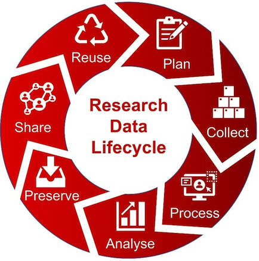

# Research Data Management

Research Data Management (RDM) is the systematic organization, storage, documentation, and sharing of data generated or collected during research endeavors to ensure its integrity, accessibility, and reusability. It involves planning for data handling throughout the research lifecycle to support valid and transparent scientific practices.

## Why do you need proper RDM?

The primary goal of research data management is to ensure that research data is of high quality, securely stored, and easily accessible for future reference, verification, and reuse. Effective research data management practices save time by conducting your research in an efficient way and reduce risk of data loss, enhance the reproducibility of research findings, promote collaboration, and contribute to the overall integrity and credibility of scientific research. Such practices also help you get recognized for your work.

RDM helps you comply with internal and external requirements ([TU/e Code of Scientific Conduct](https://www.tue.nl/en/our-university/about-the-university/integrity/scientific-integrity/), [Netherlands Code of Conduct for Research Integrity](https://www.nwo.nl/sites/nwo/files/documents/Netherlands%2BCode%2Bof%2BConduct%2Bfor%2BResearch%2BIntegrity_2018_UK.pdf), [GDPR](https://gdpr-info.eu/), [Funder requirements ​](https://www.tue.nl/en/our-university/library/library-for-researchers-and-phds/research-data-management/rdm-themes/funder-requirements/)). Many institutions and funding agencies now require researchers to have clear data management plans in place as part of their research projects.
For a quick start, check our general RDM guidelines and FAQ.

## Research Data Lifecycle

Data management is a crucial aspect of the **research data lifecycle**, which involves the various stages of data handling from its inception to its ultimate disposition. Throughout the research data lifecycle, data management includes tasks such as planning your research, collecting data using various methods, processing and analysing data, organizing and documenting data, securely storing and preserving it, sharing it responsibly, and eventually properly disposing of or archiving it for future reuse. This systematic approach to data management ensures that research data remains reliable, accessible, and compliant with ethical and legal requirements, promoting transparency and contributing to better and more efficient scientific research.

