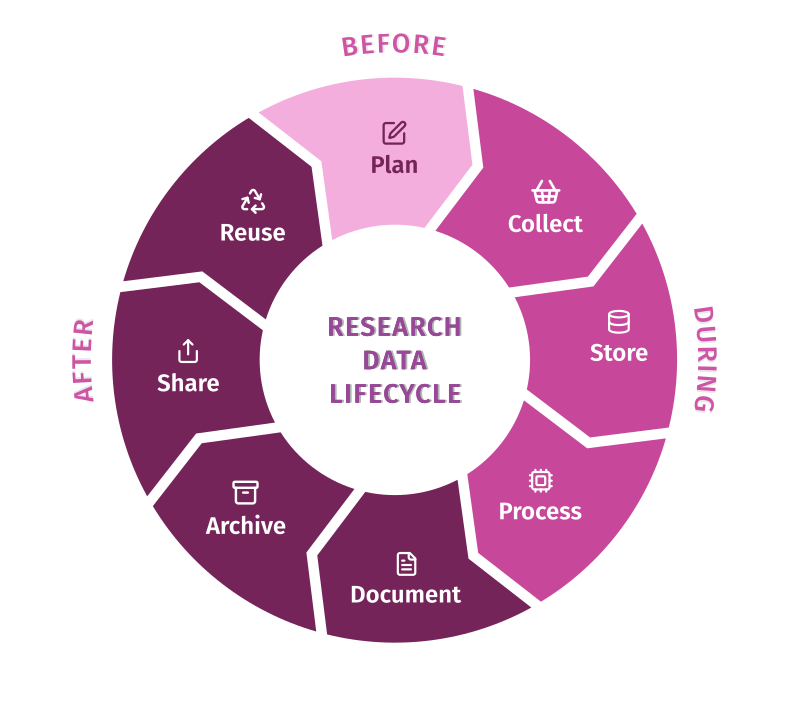

# Research Data Lifecycle

Data management is a crucial aspect of the **Research Data Lifecycle**, which involves the various stages of data handling from its inception to its ultimate disposition. Throughout the research data lifecycle, data management includes tasks such as planning your research, collecting data using various methods, processing and analysing data, organizing and documenting data, securely storing and preserving it, sharing it responsibly, and eventually properly disposing of or archiving it for future reuse. This systematic approach to data management ensures that research data remains reliable, accessible, and compliant with ethical and legal requirements, promoting transparency and contributing to better and more efficient scientific research.

