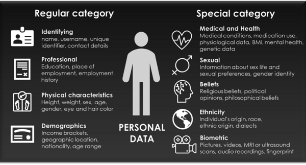

# Privacy

## GDPR and personal data

The GDPR stands for [General Data Protection Regulation](https://eur-lex.europa.eu/legal-content/EN/TXT/?qid=1532348683434&uri=CELEX:02016R0679-20160504) (in the Netherlands known as ‘Algemene Verordening Gegevensbescherming’ (**AVG**)).  . The GDPR applies from May 25, 2016, and has been enforced since May 25, 2018. The GDPR is valid throughout the European Union (EU). The GDPR requires you, as a researcher, to provide clarity and transparency to data subjects (i.e., participants in your study) about how you handle and process personal data. Moreover, it demands that certain safeguards and security measures will be put in place to protect the privacy of data subjects.

GDPR defines ‘personal data’ as any information relating to an identified or identifiable natural person (‘data subject’). Personal data also includes data that indirectly reveal something about a natural person. Personal data can lead to the physical, physiological, genetic, mental, economic, cultural or social identity of a natural person. However, data of deceased persons or organizations are not considered to be personal data because they are not natural persons. There are different types of personal data: normal personal data and special category personal data (see figure below).

The usage of special category personal data in research requires extra security measurements in order to safeguard the privacy of data subjects and to comply with the GDPR. Processing of this special category personal data is prohibited, except for specific purposes and un/@der certain circumstances. If you need to process special category data, please consult the data stewards of the RDM support team.

The Privacy Team of TU/e has published an [FAQ](https://tuenl.sharepoint.com/sites/intranet-privacy-security/SitePages/about-the-gdpr.aspx) on the GDPR.

## Processing Personal Data

Processing personal data in research should be done with caution and should include measures that are important to safeguard the privacy and rights of your data subjects. Consider the following:

**Work safely**  
With personal data, it is particularly important to work safely. Do not leave printouts on the printer or desk, do not use public Wi-Fi, do not work where others can easily watch your screen or hear you talk, do not leave you laptop logged in when you are away, etc.

**Apply data minimization**   
Collect as little personal information as possible and necessary for your research.

**Work with de-identified data**  
Personal data can either be anonymized (data cannot (under any circumstances) be traced back to a person) or pseudonymized (no immediate identification, but it remains possible to identify a person from the data with additional information). Up until the anonymization takes place, the data is still personal data (not anonymized). Consequently, in these cases data subjects should not be informed that the survey is anonymous (this erroneously happens often).

The **anonymization** process aims at irreversibly preventing the identification of an individual study participant. It is quite a challenging process, which involves the use of complicated and ever-changing [**techniques**](https://www.gdprsummary.com/anonymization-and-gdpr/), such as randomization, generalization or masking. Which type of techniques works best depends on the situation. For the data to be considered truly (i.e., effectively and sufficiently) anonymized, all direct identifiers (such as name, address, telephone number, email address) and all indirect identifiers (such as age, place of birth, occupation, education, income) need to be irreversibly altered in such a way that a data subject can no longer be directly or indirectly identifiable either by the data controller alone or in collaboration with any other party.

If you are not sure whether your data is completely anonymized or you have questions about the anonymization process contact the data steward of your department for help.

[**Pseudonymization**](https://lcrdm.nl/wp-content/uploads/2023/03/LCRDM-Basic-Steps-Pseudonymization-2019.pdf): replacing any identifying characteristic(s) of a data subject with an artificial pseudonym, or in other words, a value which does not allow the data subject to be directly identified. This means that identification is still possible with the identification key. The identification key must be stored securely and separately from the pseudonymized data. If the data subject can be identified by combining data with additional information, the data is also called pseudonymous. Privacy laws do apply to pseudonymized data. You can find more information about pseudonymization [**here**](https://lcrdm.nl/wp-content/uploads/2023/03/LCRDM-Pseudonymization-and-key-files_ENG_online.pdf).

**Encryption:** if it is not feasible to de-identify the data, encrypting data is also an option. Encryption makes data unreadable or inaccessible to those without a password. The data file itself can be encrypted or the drive, where the data file is located, can be encrypted.

**Ensure storage limitation**  
Store personal data for no longer than is necessary for your research purposes. Do not store or distribute unnecessary copies of the data. Store identifiable information apart from other information. To comply with the [Netherlands Code of Conduct for Research Integrity](https://www.nwo.nl/sites/nwo/files/documents/Netherlands%2BCode%2Bof%2BConduct%2Bfor%2BResearch%2BIntegrity_2018_UK.pdf), de-identified data should be kept for a period appropriate to the respective discipline and methodology.

For storage options, check [**TU/e storage finder**](https://research-it.pages.tue.nl/storage-finder/), discuss the most suitable storage with your supervisor, or contact the a data steward or Research IT consultant.

**Restrict access**  
In case of collaboration, define who has access collected data, how you will restrict this, how you will enable access to those authorized, and where you will describe who gets access to the data. Do not share or keep the data in a form which permits identification of data subjects for any longer than is necessary for the purposes for which the personal data are processed.

**Be prepared for data subject (i.e., study participants) requests**  
Respondents should be able to successfully invoke their data subject rights within four weeks if the study includes their personal data. For example, the right to:

- a rectification of their personal data;
- have their data erased;
- access the data that is being processed on them.
- a restriction on the usage of their data;

If you receive formal data subject requests that you cannot handle within four weeks, please consult your data steward and the privacy team via privacy@tue.nl.

**Processing agreement**   
If you engage other parties to process personal data (a processor) on behalf of your organization then you must record agreements about that processing of personal data in an agreement (in writing, may also be electronic). Topics that are covered in a processing agreement are: general description of the project, confidentiality, security, compliance with the GDPR, privacy rights, etc. More information and a template can be found [**here**](https://tuenl.sharepoint.com/sites/intranet-privacy-security/SitePages/agreements.aspx).

## Data Protection Officer (DPO) of TU/e?

The university has appointed a Data Protection Officer (DPO) as an independent, internal supervisor and advisor. The DPO consults the TU/e to ensure that the processing of personal data is compliant with the applicable legislation on personal data. The DPO is available via +31 (0)40 247 3809 or [dataprotectionofficer@remove-this.tue.nl](https://www.tue.nl/en/our-university/library/library-for-researchers-and-phds/research-data-management/privacy-in-research/privacy#).

## What to do in case of a suspected data breach?

If devices or data are lost or stolen please contact the Computer Emergency Response Team ([cert@tue.nl](https://www.tue.nl/en/our-university/library/library-for-researchers-and-phds/research-data-management/rdm-themes/privacy-and-ethics)) as quickly as possible and definitely within 24 hours if personal data is involved. More information can be found [**here**](https://tuenl.sharepoint.com/sites/intranet-privacy-security/SitePages/data-breach-report-it.aspx).

## FAQ

### Where can I find answers to my questions on personal data, GDPR, and privacy?

Below are some relevant resources:

- [Personal Data in Research | Research Cockpit (login required)](https://cockpit.research.tue.nl/servicedesk/customer/portal/3/article/2641100840)
- [FAQ About the GDPR | SharePoint (login required)](https://tuenl.sharepoint.com/sites/intranet-privacy-security/SitePages/about-the-gdpr.aspx)
- [What are personal data? | Utrecht University](https://utrechtuniversity.github.io/dataprivacyhandbook/personal-data.html).

You can also consult a [Data Steward](/docs/contact.md).

### Do I need to make any specific arrangements before I share the data externally?

Sharing or receiving (personal) data from an external party requires an appropriate [data agreement](https://tuenl.sharepoint.com/sites/intranet-privacy-security/SitePages/agreements.aspx). The type of agreement depends on the nature of collaboration between the parties. If you plan to share your research data or receiving data from a third party, please contact your [Data Steward](/docs/contact.md).

### How should I anonymize or pseudonymize my data?

Information on anonymization and pseudonymization is available on the [Privacy page](/docs/privacy/privacy/privacy.md) and the [FAQ About the GDPR (login required)](https://tuenl.sharepoint.com/sites/intranet-privacy-security/SitePages/about-the-gdpr.aspx#what-are-anonymous%2C-anonymized-and-pseudonymized-personal-data). For further information and support, please contact a [Data Steward](/docs/contact.md).

## Tools and Further Reading

- [FAQ privacy and security](https://intranet.tue.nl/en/university/services/01-01-1970-information-management-services/protect-your-device-data-and-identity/faq/research/)
- [How to Treat Personal Data in Research | LCRDM](https://lcrdm.nl/wp-content/uploads/2023/03/LCRDM-How-to-treat-personal-data-in-research-0_1.pdf)
- [TU/e Privacy statement](https://intranet.tue.nl/en/university/services/01-01-1970-information-management-services/protect-your-device-data-and-identity/protect-your-identity/01-01-1970-privacystatement-tue/#c49343)
- [TU/e Privacy policy](https://intranet.tue.nl/en/university/services/01-01-1970-information-management-services/protect-your-device-data-and-identity/protect-your-identity/01-01-1970-tue-strategy/)
